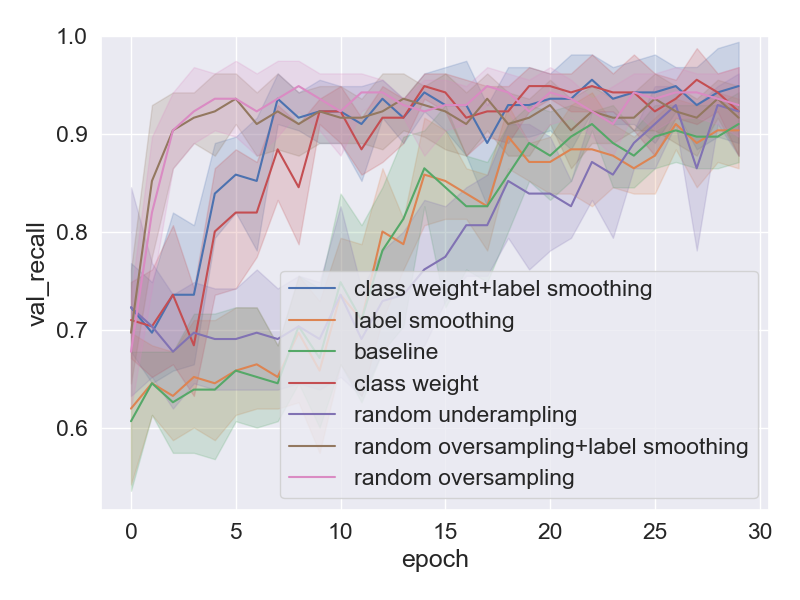

# GW Universe project

## Installation
~~~
git clone https://github.com/minds/gw_universe.git
cd gw_universe
pip install -e .
~~~

## Real vs. Bogus classification

We conducted a set of experiments with different strategies to resolve the class imbalance in the Real vs. Bogus dataset
. You can find all python scripts for the experiments in the `experiments` folder.
- baseline.py: No strategy is applied

 

Once a set of experiments is finished, you can visualize the learning curve of a specific metric as follows:
~~~
python gw_universe/utils/plotting.py --target val_recall --dir_results ./results --save ./results/recall.png
~~~

This gives you a figure as below:

