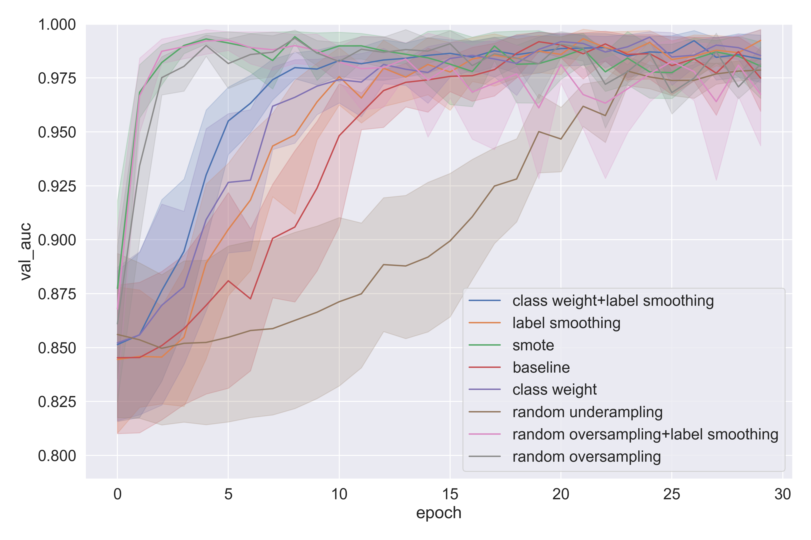
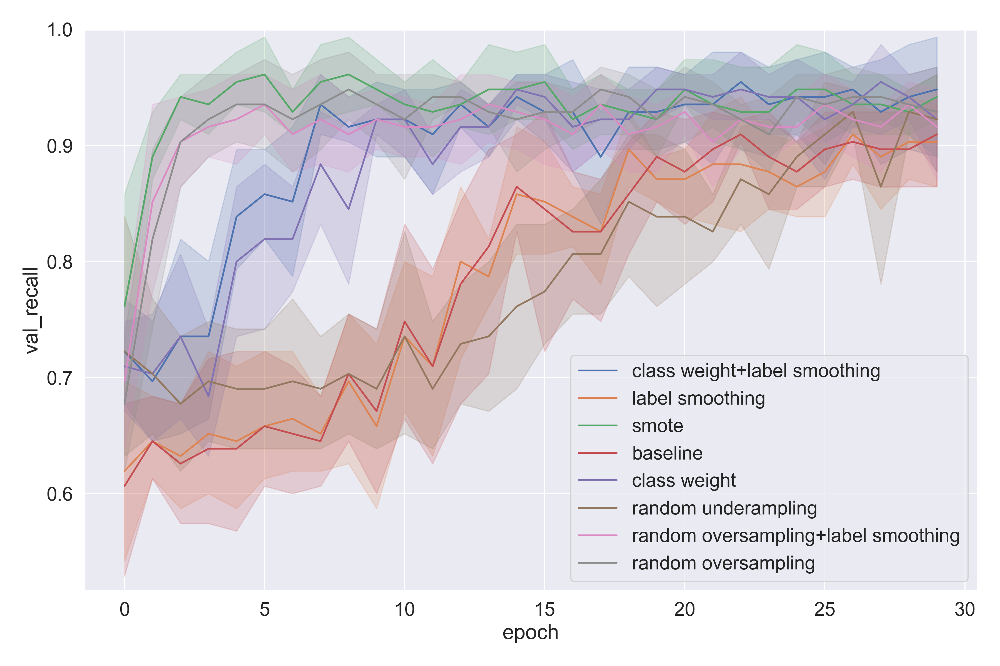
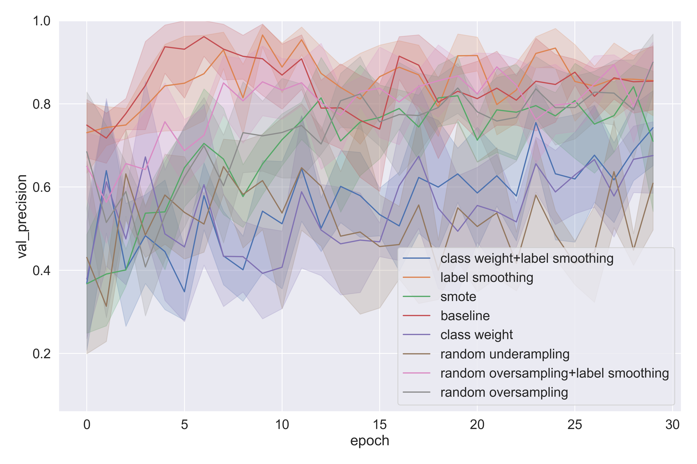

# GW Universe project

## Installation
~~~
git clone https://github.com/postech-minds/gw_universe.git
cd gw_universe
pip install -e .
~~~

## Real vs. Bogus classification

We conducted a set of experiments with different strategies to resolve the class imbalance in the Real vs. Bogus dataset
. All experiments can be reproduced by running `run_all_experiments.sh`:
~~~
bash run_all_experiments.sh
~~~
 
 Name                    | Description 
:-----------------------:|:----------------------------------------------------------------------:
 `baseline`              | No strategy is applied
 `label smoothing`       | Label smoothing with alpha=0.2
 `class weight`          | More penalties for incorrect samples in the minority class
 `random oversampling`   | For each epoch, minor samples are oversampled to # of major samples
 `random undersampling`  | For each epoch, major samples are undersampled to # of minor samples

 

Once a set of experiments is finished, you can visualize the learning curve of a specific metric as follows:
~~~
python gw_universe/utils/plotting.py --target val_auc --dir_results ./results --save ./results/auc.png
python gw_universe/utils/plotting.py --target val_recall --dir_results ./results --save ./results/recall.png
python gw_universe/utils/plotting.py --target val_precision --dir_results ./results --save ./results/precision.png
~~~

This gives you a figure as below:

    
    
    

